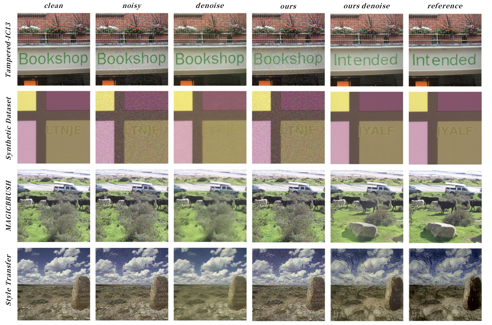

# Mutual-Information-Guided-Denoising-Attack(MIGDA)

## Abstract

> Traditional denoising methods have two main objectives: to effectively reduce noise for enhanced visual clarity and to preserve key semantic information for downstream tasks. However, pre-trained deep learning-based denoising models are highly vulnerable to adversarial attacks due to their reliance on specific noise distribution assumptions. Existing adversarial attacks exploit these assumptions to degrade the visual clarity of denoised images but often fail to manipulate core semantic content, resulting in outputs that are either easily detectable or have limited impact on misleading downstream tasks.
> 
> In this paper, we introduce the Mutual Information Guided Denoising Attack (MIGDA), a novel adversarial method that strategically manipulates semantic features during denoising by reducing mutual information between the original and denoised images. MIGDA applies imperceptible perturbations to the input image, which, after being processed by the denoising model, results in visually high-quality output. Simultaneously, this output has its semantic content selectively altered, deceiving both downstream models and human observers, ultimately leading to incorrect decisions. Extensive experiments with our tailored evaluation metrics for assessing semantic preservation in denoised images show that our method effectively attacks the semantic consistency during the denoising process. This results in denoised images that mislead downstream tasks while maintaining high visual quality.


## Installation
1. **Clone the Repository**:

    ```bash
    git clone git@github.com:Dilemma-CMZ/Mutual-Information-Guided-Denoising-Attack.git
    cd Mutual-Information-Guided-Denoising-Attack
    ```

2. **Create a Virtual Environment (Optional but Recommended)**:

    ```bash
    conda create -n myenv python=3.7
    conda activate myenv
    ```

3. **Install Required Packages**:

    install the packages manually:

    ```bash
    conda install pytorch=1.8 torchvision cudatoolkit=10.2 -c pytorch
    pip install matplotlib scikit-learn scikit-image opencv-python yacs joblib natsort h5py tqdm
    pip install einops gdown addict future lmdb numpy pyyaml requests scipy tb-nightly yapf lpips
    ```

## Unknown Task

The attack generates perturbed images that, when processed by the denoising model, produce outputs similar to target images.


### Installation

1. **Install Basicsr**:

    ```bash
    cd Unknown-Task
    python setup.py develop --no_cuda_ext
    ```

### Pretrained Models

Download the pretrained models and place them in the appropriate directories:

1. **Restormer Pretrained Model**:

    - Download the model from [here](https://drive.google.com/drive/folders/1Qwsjyny54RZWa7zC4Apg7exixLBo4uF0?usp=sharing).
    - Place the downloaded `.pth` file in the `./pretrained_models/` directory.

2. **VGG16 Pretrained Model**:

    - Download the model from [here](https://download.pytorch.org/models/vgg16-397923af.pth).
    - Place the downloaded `.pth` file in the `./pretrained_models/` directory.

3. **MINE Model**:

    - Ensure you have the `mine_model.pth` file in the root directory (same level as `Attack.py`).

### Dataset Preparation

Prepare your datasets for the attack:

1. **Original Images**:

    - Place your original images in a folder (e.g., `/path/to/original_images/`).
    - The images should be named numerically starting from `1` (e.g., `1.png`, `2.png`, ...).

2. **Target Images**:

    - Place your target images in a folder (e.g., `/path/to/target_images/`).
    - Ensure the target images correspond to the original images by name.


### Usage

1. **Set the Paths**:

    Open `Attack.py` and modify the following variables to point to your datasets:

    ```python
    original_folder = '/path/to/original_images'
    target_folder = '/path/to/target_images'
    result_folder = '/path/to/save_results'
    batch_size = 16  # Adjust as needed
    ```

2. **Run the Attack**:

    Execute the attack script:

    ```bash
    python Attack.py
    ```

3. **Results**:

    - The perturbed images and the restored outputs will be saved in subfolders within the `result_folder`.
    - Each subfolder corresponds to an image and contains:
        - `original.png`: The original image.
        - `target.png`: The target image.
        - `perturbed.png`: The perturbed image after the attack.
        - `restored_original.png`: The output of the denoising model on the original image.
        - `restored_perturbed.png`: The output of the denoising model on the perturbed image.
        - `log.txt`: Log file containing loss information during optimization.

## License

This project is licensed under the MIT License - see the [LICENSE](LICENSE) file for details.

---

**Disclaimer**: This code is for research purposes only. Use responsibly and ensure compliance with relevant laws and ethical guidelines.
